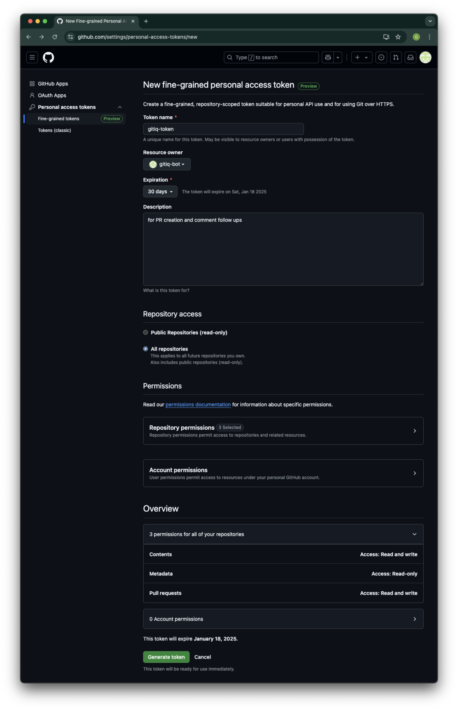
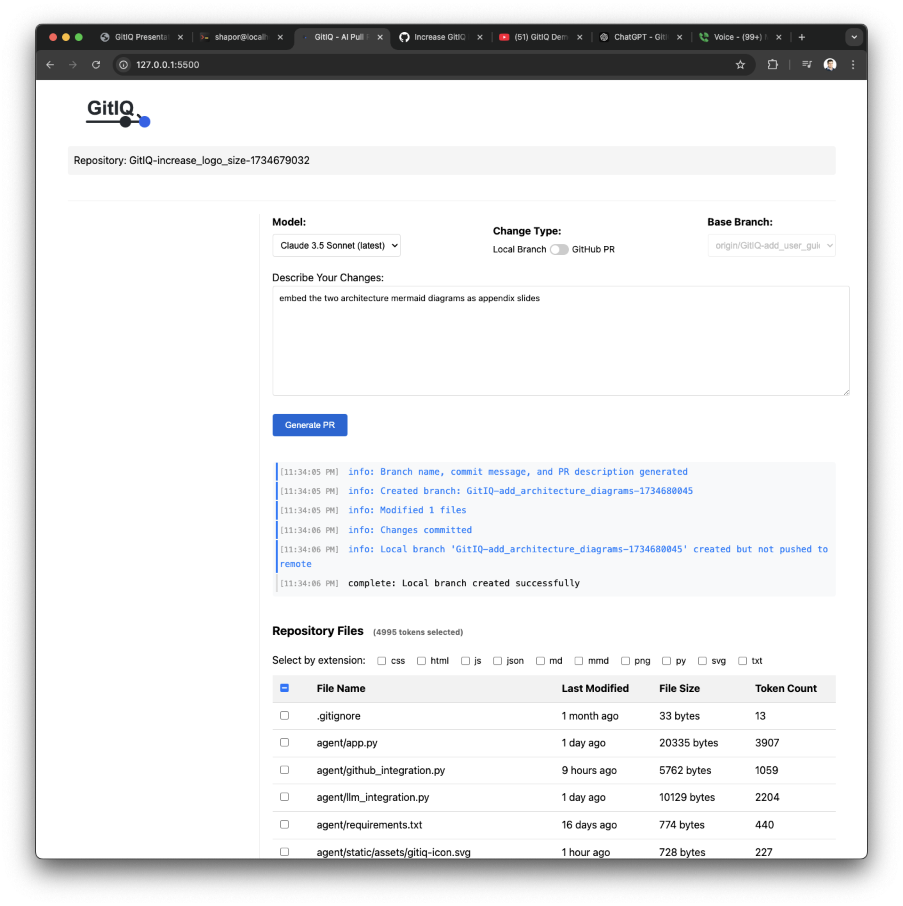

# GitIQ User Guide

## Table of Contents
1. [Prerequisites](#prerequisites)
2. [Installation](#installation)
3. [Configuration](#configuration)
4. [Running GitIQ](#running-gitiq)
5. [Using the Interface](#using-the-interface)

## Prerequisites

Before getting started with GitIQ, ensure you have:
- Python 3.8 or higher installed
- Git installed and configured
- A GitHub account (if you want to create Pull Requests)

## Installation

1. Clone the GitIQ repository:
```bash
git clone https://github.com/shapor/gitiq.git
cd gitiq
```

2. Create and activate a Python virtual environment:
```bash
# Create virtual environment
python -m venv venv

# Activate on Windows
venv\Scripts\activate

# Activate on macOS/Linux
source venv/bin/activate
```

3. Install required packages:
```bash
pip install -r requirements.txt
```

## Configuration

### Setting Up API Keys

1. **OpenAI API Key**
   - Visit [OpenAI API Keys](https://platform.openai.com/api-keys)
   - Create a new API key
   - Set the environment variable:
     ```bash
     # Windows
     set OPENAI_API_KEY=your_api_key_here
     
     # macOS/Linux
     export OPENAI_API_KEY=your_api_key_here
     ```

2. **GitHub Access Token**
   - Visit GitHub Settings > Developer Settings > Personal Access Tokens > Tokens (classic)
   - Click "Generate new token (classic)"
   - Select the following permissions:
     - repo (all)
     - workflow
   
   
   
   - Set the environment variable:
     ```bash
     # Windows
     set GITHUB_ACCESS_TOKEN=your_token_here
     
     # macOS/Linux
     export GITHUB_ACCESS_TOKEN=your_token_here
     ```

3. **Other LLM Providers (Optional)**
   If you want to use other LLM providers, set their respective environment variables as defined in `config.json`:
   ```bash
   export ANTHROPIC_API_KEY=your_key_here
   export GROQ_API_KEY=your_key_here
   export VERTEX_ACCESS_TOKEN=your_key_here
   # etc.
   ```

## Running GitIQ

1. Start the GitIQ server:
```bash
python agent/app.py
```

2. Open your web browser and navigate to:
```
http://127.0.0.1:5500
```

You should see the GitIQ interface:


## Using the Interface

1. **Select Files**
   - Browse the repository file tree on the left
   - Check the boxes next to files you want to modify
   - You can also add context files that won't be modified but provide additional information

2. **Choose Change Type**
   - Use the toggle switch in the top section to select your preferred change type:
     - **Local Branch** (toggle left): Changes will be created in a new local git branch only
     - **GitHub PR** (toggle right): Changes will be pushed and a Pull Request will be created
   
   When you select GitHub PR and submit your changes, you'll see a success message with a direct link to the created PR:
   
   

3. **Select Model**
   - Choose from available LLM models in the dropdown
   - Different models have different capabilities and costs

4. **Enter Prompt**
   - Describe the changes you want to make in natural language
   - Be specific about what you want to change
   - Include any relevant context or requirements

5. **Submit**
   - Click the Submit button to generate changes
   - Watch the progress in real-time
   - For GitHub PRs, you'll get a link to the created PR
   - For local branches, you'll see the branch name where changes were made

## Tips for Best Results

1. **Clear Prompts**
   - Be specific about what you want to change
   - Include implementation details if you have preferences
   - Mention any constraints or requirements

2. **File Selection**
   - Select all relevant files that need modification
   - Include context files that help understand the changes
   - Don't select files that shouldn't be modified

3. **Review Changes**
   - Always review the generated changes
   - For PRs, use GitHub's review interface
   - For local branches, use `git diff` or your preferred tool

4. **Iterative Refinement**
   - If changes aren't quite right, comment on the PR
   - GitIQ can refine changes based on feedback
   - You can also create new branches with modified prompts

## Troubleshooting

1. **API Key Issues**
   - Ensure environment variables are set correctly
   - Check API key permissions and quotas
   - Verify the keys in your environment match config.json

2. **GitHub Integration**
   - Verify GitHub token has correct permissions
   - Ensure repository access is configured
   - Check GitHub API rate limits

3. **Model Errors**
   - Try a different model if one fails
   - Check model-specific token limits
   - Verify API provider status

4. **Connection Issues**
   - Ensure you're connected to the internet
   - Check if the GitIQ server is running
   - Verify the correct localhost port (5500)

For more detailed information, refer to:
- [API Documentation](API.md)
- [Configuration Guide](LLM_Configuration.md)
- [Style Guide](Style_Guide.md)
